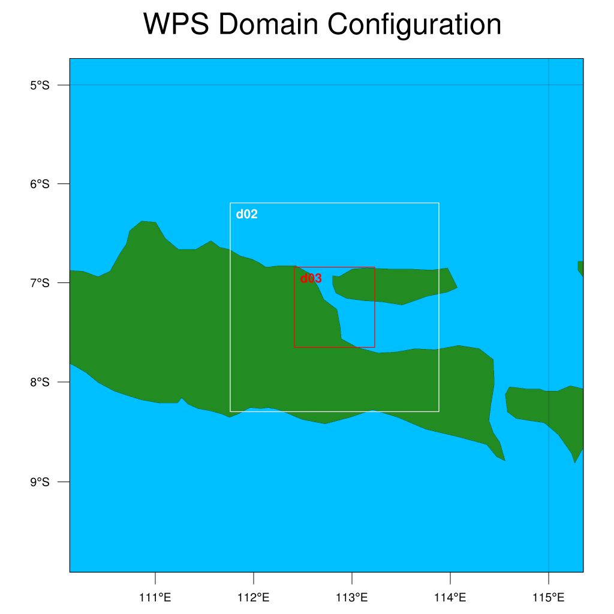

# *Dynamical Downscaling*

Teknik *dynamical downscaling* dapat merepresentasikan proses-proses fisika (hukum termodinamika, hukum kekekalan energi, hukum gerak) pada setiap skala grid. Teknik ini membutuhkan kondisi batas menggunakan data GCM dan perlu memilih lokasi saat kita ingin melakukan simulasi. Teknik ini merujuk pada penggunaan model iklim regional (*Regional Climate Model*, RCM) untuk meningkatkan skala spasial dari GCM. Model iklim regional meliputi komponen dinamik dan fisik. Model dinamik memperhitungkan komponen fisika dari model regional yang mencakup proses-proses fisik, seperti radiasi gelombang panjang dan pendek, presipitasi, dan proses pertukaran energi di permukaan bumi atau laut. Proses pada skala sub-piksel dimodelkan oleh parameterisasi dari persamaan diferensial [@maity2013].

Pada tahun 1965, John Drake dan Ian Foster membahas tentang permasalahan mengenai *Parallel Computing* pada model iklim dan cuaca. Hal itu terkait dengan penyesuaian model global atmosfer bumi dan lautan pada perhitungan secara paralel. Masalah khusus difokuskan pada karakteristik khusus, masalah, dan strategi implementasi komputasi paralel untuk cabang terkait aplikasi geofisika, yaitu model skala regional [@maity2013]. 

Sumber daya komputasi yang diperlukan untuk menjalankan teknik ini lebih banyak daripada *Statistical Downscaling*. Sumber daya komputasi yang dibutuhkan semakin besar jika resolusi spasial yang kita inginkan semakin tinggi.

Di dalam artikel ini, kami menyajikan cara memasang dan menjalankan *Weather Research Forecasting* (WRF) pada sistem operasi Linux (Distro Ubuntu). 

## Weather Research Forecasting (WRF)

Penggunaan model WRF semakin berkembang saat ini dengan tujuan riset dan penggunaan operasional. WRF memiliki spesifikasi pada berbagai aplikasi prediksi di dalam sistem bumi, seperti kimia atmosfer, hidrologi, kebakaran hutan, dan siklon. WRF menjadi salah satu model atmosfer bumi yang paling banyak digunakan di dunia sejak rilis pertama kali pada tahun 2000. Sebanyak lebih dari 36000 pengguna WRF tersebar di 162 negara, termasuk Indonesia yang telah menggunakan WRF untuk kebutuhan operasional. Kerangka kerja perangkat lunak WRF mendukung komputasi paralel yang efisien pada berbagai platform komputasi. Model WRF bisa dijalankan pada personal komputer hingga supercomputer yang memiliki sistem operasi UNIX [@powers2017]. Ada dua jenis model WRF berdasarkan penyelesaian persamaan aliran fluida atmosfer, yaitu *Advanced Research WRF* (ARW) dan *Nonhydrostatic Mesoscale Model* (NMM). Pengembang kedua tipe model WRF berbeda. WRF-ARW dikembangkan oleh National Centre of Atmosphere Research (NCAR), sedangkan WRF-NMM dikembangkan oleh National Centre of Environmental Prediction (NCEP) [@skamarock2019]. 

> Tutorial instalasi WRF diperoleh dari website https://www2.mmm.ucar.edu/wrf/OnLineTutorial/compilation_tutorial.php

Sebelum memasang model WRF pada komputer Anda, Anda perlu membuat direktori atau folder baru, misalnya dengan nama `WRF-Model`. Folder ini terletak di direktori `~` atau `/home/<nama_user>`. Kemudian, buka folder yang telah Anda buat dengan perintah `cd`. 

> `<nama_user>`: username pada masing-masing komputer. Username pada komputer saya adalah **absen**.

```bash
mkdir WRF-Model
cd WRF-Model
```

Buat lagi folder baru untuk menampung software pendukung tambahan, misalnya dengan nama `LIBRARIES`

```bash
mkdir LIBRARIES
```

### 1. Instalasi Software Pendukung

Instal software png, zlib, gfortran, csh, gcc, make, mpich, git, dan m4. Pastikan Anda memiliki koneksi internet.

```bash
sudo apt update && sudo apt upgrade
sudo apt install -y libpng-dev zlib1g-dev gfortran csh gcc mpich git make m4 
```

Buka folder `LIBRARIES` kemudian unduh software netcdf-c, netcdf-fortran, hdf5, dan jasper. Kemudian ekstrak file kompres tersebut.

```bash
wget https://www.unidata.ucar.edu/downloads/netcdf/ftp/netcdf-c-4.8.0.tar.gz
wget https://www.unidata.ucar.edu/downloads/netcdf/ftp/netcdf-fortran-4.5.3.tar.gz
wget https://support.hdfgroup.org/ftp/HDF5/releases/hdf5-1.12/hdf5-1.12.0/src/hdf5-1.12.0.tar.gz
wget https://www.ece.uvic.ca/~frodo/jasper/software/jasper-1.900.2.tar.gz

# Extract
tar -xf netcdf-c-4.8.0.tar.gz
tar -xf netcdf-fortran-4.5.3.tar.gz
tar -xf hdf5-1.12.0.tar.gz
tar -xf jasper-1.900.2.tar.gz
```

Ikuti langkah-langkah berikut untuk melakukan instalasi keempat software tersebut

+ Jasper

```bash
cd jasper-1.900.2.tar.gz
./configure --prefix=/usr/local
sudo make check install
cd ..
```

+ HDF5

```bash
cd hdf5-1.12.0.tar.gz
./configure --prefix=/usr/local --enable-fortran
sudo make check install
cd ..
```

+ NetCDF

```bash
# Install netcdf-c
cd netcdf-c-4.8.0
./configure --prefix=/usr/local --disable-dap
sudo make check install
cd .. 

# Install netcdf-fortran
cd netcdf-fortran-4.5.3
./configure --prefix=/usr/local 
sudo make check install
cd .. 
cd ..
```

### 2. Instalasi WRF dan WPS

Anda perlu mengunduh terlebih dahulu file source code WRF dan WPS melalui perintah `git clone`. Kedua file tersebut sudah memiliki versi terbaru. Pastikan Anda berada di direktori `/home/absen/WRF-Model` sebelum menjalankan perintah berikut.

```bash
git clone https://github.com/wrf-model/WRF
git clone https://github.com/wrf-model/WPS
```

Setelah software pendukung dan source code WRF dan WPS telah berhasil dipasang dan diunduh, Anda dapat memasang model WRF dan software WPS dengan langkah-langkah berikut.

+ Membuat environment variable. Ini sangat diperlukan untuk instalasi WRF maupun WPS
```bash
export NETCDF=/usr/local
export HDF5=/usr/local
export JASPERLIB=/usr/local/lib
export JASPERINC=/usr/local/include
```
+ Menuju direktori hasil kompresi WRF dengan mengetik perintah `cd WRF`
+ Ketik perintah berikut untuk mulai memasang WRF.
```bash
./configure
```
Kemudian muncul respons sebagai berikut
```
checking for perl5... no
checking for perl... found /usr/bin/perl (perl)
Will use NETCDF in dir: /usr/local
Will use HDF5 in dir: /usr/local
PHDF5 not set in environment. Will configure WRF for use without.
Will use 'time' to report timing information


If you REALLY want Grib2 output from WRF, modify the arch/Config.pl script.
Right now you are not getting the Jasper lib, from the environment, compiled into WRF.

------------------------------------------------------------------------
Please select from among the following Linux x86_64 options:

  1. (serial)   2. (smpar)   3. (dmpar)   4. (dm+sm)   PGI (pgf90/gcc)
  5. (serial)   6. (smpar)   7. (dmpar)   8. (dm+sm)   PGI (pgf90/pgcc): SGI MPT
  9. (serial)  10. (smpar)  11. (dmpar)  12. (dm+sm)   PGI (pgf90/gcc): PGI accelerator
 13. (serial)  14. (smpar)  15. (dmpar)  16. (dm+sm)   INTEL (ifort/icc)
                                         17. (dm+sm)   INTEL (ifort/icc): Xeon Phi (MIC architecture)
 18. (serial)  19. (smpar)  20. (dmpar)  21. (dm+sm)   INTEL (ifort/icc): Xeon (SNB with AVX mods)
 22. (serial)  23. (smpar)  24. (dmpar)  25. (dm+sm)   INTEL (ifort/icc): SGI MPT
 26. (serial)  27. (smpar)  28. (dmpar)  29. (dm+sm)   INTEL (ifort/icc): IBM POE
 30. (serial)               31. (dmpar)                PATHSCALE (pathf90/pathcc)
 32. (serial)  33. (smpar)  34. (dmpar)  35. (dm+sm)   GNU (gfortran/gcc)
 36. (serial)  37. (smpar)  38. (dmpar)  39. (dm+sm)   IBM (xlf90_r/cc_r)
 40. (serial)  41. (smpar)  42. (dmpar)  43. (dm+sm)   PGI (ftn/gcc): Cray XC CLE
 44. (serial)  45. (smpar)  46. (dmpar)  47. (dm+sm)   CRAY CCE (ftn $(NOOMP)/cc): Cray XE and XC
 48. (serial)  49. (smpar)  50. (dmpar)  51. (dm+sm)   INTEL (ftn/icc): Cray XC
 52. (serial)  53. (smpar)  54. (dmpar)  55. (dm+sm)   PGI (pgf90/pgcc)
 56. (serial)  57. (smpar)  58. (dmpar)  59. (dm+sm)   PGI (pgf90/gcc): -f90=pgf90
 60. (serial)  61. (smpar)  62. (dmpar)  63. (dm+sm)   PGI (pgf90/pgcc): -f90=pgf90
 64. (serial)  65. (smpar)  66. (dmpar)  67. (dm+sm)   INTEL (ifort/icc): HSW/BDW
 68. (serial)  69. (smpar)  70. (dmpar)  71. (dm+sm)   INTEL (ifort/icc): KNL MIC
 72. (serial)  73. (smpar)  74. (dmpar)  75. (dm+sm)   FUJITSU (frtpx/fccpx): FX10/FX100 SPARC64 IXfx/Xlfx

Enter selection [1-75] : 

```
Pilih dmpar dengan compiler gfortran jika sudah menginstal `mpich` dengan mengetik angka 34 atau 32 jika tidak memasang `mpich`. Tekan Enter dan setelah itu ketik angka 1, kemudian Enter lagi. Jika sudah selesai melakukan konfigurasi, langkah selanjutnya ketikkan perintah berikut.
```bash
./compile -j 4 em_real 
```
> Proses instalasi berlangsung sekitar 20-30 menit tergantung jenis prosesor. Opsi `-j 4` membantu proses instalasi lebih cepat dengan menggunakan 4 prosesor atau dijalankan secara paralel. Tapi, Anda perlu memasang `mpich` terlebih dahulu. 

+ Untuk mengecek proses instalasi sudah selesai, ketikkan perintah
```bash
ls main/*.exe
```
Jika sudah terdapat program `ndown.exe`, `real.exe`, `tc.exe`, dan `wrf.exe` atau dengan respons pada perintah di atas seperti ini
```bash
main/ndown.exe  main/real.exe  main/tc.exe  main/wrf.exe
```
lanjutkan ke tahapan berikutnya untuk memasang WPS

+ Keluar dari direktori WRF dengan perintah `cd ..`
+ Menuju direktori hasil kompresi WPS dengan mengetik perintah `cd WPS`
+ Ketik perintah berikut untuk mulai memasang WPS 
```bash
./configure
```
Setelah mengetik perintah tersebut, maka muncul respons
```
Will use NETCDF in dir: /usr/local
Found what looks like a valid WRF I/O library in ../WRF
Found Jasper environment variables for GRIB2 support...
  $JASPERLIB = /usr/local/lib
  $JASPERINC = /usr/local/include
------------------------------------------------------------------------
Please select from among the following supported platforms.

   1.  Linux x86_64, gfortran    (serial)
   2.  Linux x86_64, gfortran    (serial_NO_GRIB2)
   3.  Linux x86_64, gfortran    (dmpar)
   4.  Linux x86_64, gfortran    (dmpar_NO_GRIB2)
   5.  Linux x86_64, PGI compiler   (serial)
   6.  Linux x86_64, PGI compiler   (serial_NO_GRIB2)
   7.  Linux x86_64, PGI compiler   (dmpar)
   8.  Linux x86_64, PGI compiler   (dmpar_NO_GRIB2)
   9.  Linux x86_64, PGI compiler, SGI MPT   (serial)
  10.  Linux x86_64, PGI compiler, SGI MPT   (serial_NO_GRIB2)
  11.  Linux x86_64, PGI compiler, SGI MPT   (dmpar)
  12.  Linux x86_64, PGI compiler, SGI MPT   (dmpar_NO_GRIB2)
  13.  Linux x86_64, IA64 and Opteron    (serial)
  14.  Linux x86_64, IA64 and Opteron    (serial_NO_GRIB2)
  15.  Linux x86_64, IA64 and Opteron    (dmpar)
  16.  Linux x86_64, IA64 and Opteron    (dmpar_NO_GRIB2)
  17.  Linux x86_64, Intel compiler    (serial)
  18.  Linux x86_64, Intel compiler    (serial_NO_GRIB2)
  19.  Linux x86_64, Intel compiler    (dmpar)
  20.  Linux x86_64, Intel compiler    (dmpar_NO_GRIB2)
  21.  Linux x86_64, Intel compiler, SGI MPT    (serial)
  22.  Linux x86_64, Intel compiler, SGI MPT    (serial_NO_GRIB2)
  23.  Linux x86_64, Intel compiler, SGI MPT    (dmpar)
  24.  Linux x86_64, Intel compiler, SGI MPT    (dmpar_NO_GRIB2)
  25.  Linux x86_64, Intel compiler, IBM POE    (serial)
  26.  Linux x86_64, Intel compiler, IBM POE    (serial_NO_GRIB2)
  27.  Linux x86_64, Intel compiler, IBM POE    (dmpar)
  28.  Linux x86_64, Intel compiler, IBM POE    (dmpar_NO_GRIB2)
  29.  Linux x86_64 g95 compiler     (serial)
  30.  Linux x86_64 g95 compiler     (serial_NO_GRIB2)
  31.  Linux x86_64 g95 compiler     (dmpar)
  32.  Linux x86_64 g95 compiler     (dmpar_NO_GRIB2)
  33.  Cray XE/XC CLE/Linux x86_64, Cray compiler   (serial)
  34.  Cray XE/XC CLE/Linux x86_64, Cray compiler   (serial_NO_GRIB2)
  35.  Cray XE/XC CLE/Linux x86_64, Cray compiler   (dmpar)
  36.  Cray XE/XC CLE/Linux x86_64, Cray compiler   (dmpar_NO_GRIB2)
  37.  Cray XC CLE/Linux x86_64, Intel compiler   (serial)
  38.  Cray XC CLE/Linux x86_64, Intel compiler   (serial_NO_GRIB2)
  39.  Cray XC CLE/Linux x86_64, Intel compiler   (dmpar)
  40.  Cray XC CLE/Linux x86_64, Intel compiler   (dmpar_NO_GRIB2)

Enter selection [1-40] :        
```
Ketikkan angka 3 untuk compiler gfortran jika sudah memasang `mpich` atau angka 1 jika tidak memasang `mpich`. Kemudian, ketik perintah
```bash
./compile
```
untuk mememulai instalasi
+ Untuk mengecek proses instalasi sudah selesai, gunakan perintah 
```bash
ls *.exe
```
Jika sudah ada program `geogrid.exe`, `metgrid.exe`, dan `ungrib.exe`, maka WPS siap untuk dijalankan. 

+ Kemudian, keluar dari direktori WPS dengan perintah `cd ..`


### 3. Mengunduh Data

Data yang diperlukan untuk menjalankan WRF terdiri dari data geografis (mis. ketinggian topografi, tipe tutupan lahan, albedo, *leaf area index*) dan data cuaca. Anda dapat mengunduh dan mengekstrak data geografis yang telah disediakan oleh pengembang WRF dengan mengetik perintah 
```bash
# File size about 2.6 GB
wget https://www2.mmm.ucar.edu/wrf/src/wps_files/geog_high_res_mandatory.tar.gz
# Extract file
gunzip geog_high_res_mandatory.tar.gz
tar -xf geog_high_res_mandatory.tar
```

Data cuaca yang digunakan dalam tutorial ini bersumber dari ERA5. Data cuaca yang diunduh memiliki resolusi temporal per 6 jam. 

Anda dapat mengunduh data ini dari website [https://cds.climate.copernicus.eu](https://cds.climate.copernicus.eu) dengan membuat akun terlebih dahulu. Anda dapat menggunakan skrip python di bawah ini untuk mengunduh data ERA5 dengan memasang package python `cdsapi`. 

```bash
pip install cdsapi #atau pip3 install cdsapi
```

Sebelum mengunduh data ERA5, Anda perlu mengetahui API key pada akun CDS Anda dengan mengklik **Climate Data Store API**. Kemudian, salin API key Anda ke fungsi `cdsapi.Client(key = "......")`.


+ Data atmosfer

```python
import cdsapi

c = cdsapi.Client(key = ".......")

start_date = '20190112' #YYYYMMDD
end_date   = '20190115' 

c.retrieve(
    'reanalysis-era5-pressure-levels',
    {
        'product_type':'reanalysis',
        'format':'grib',
        'pressure_level':[
            '1','2','3',
            '5','7','10',
            '20','30','50',
            '70','100','125',
            '150','175','200',
            '225','250','300',
            '350','400','450',
            '500','550','600',
            '650','700','750',
            '775','800','825',
            '850','875','900',
            '925','950','975',
            '1000'
        ],
        'date':f'{start_date}/{end_date}',
        'area':'12/90/-12/150',   #N/W/S/E
        'time':'00/to/23/by/6',
        'variable':[
            'geopotential','relative_humidity','specific_humidity',
            'temperature','u_component_of_wind','v_component_of_wind'
        ]
    },
    f'ERA5-{start_date}-{end_date}-pl.grib')
```

+ Data permukaan tanah

```python
import cdsapi

c = cdsapi.Client(key = ".......")

start_date = '20190112' #YYYYMMDD
end_date   = '20190115'

c.retrieve(
    'reanalysis-era5-single-levels',
    {
        'product_type':'reanalysis',
        'format':'grib',
        'variable':[
            '10m_u_component_of_wind','10m_v_component_of_wind','2m_dewpoint_temperature',
            '2m_temperature','land_sea_mask','mean_sea_level_pressure',
            'sea_ice_cover','sea_surface_temperature','skin_temperature',
            'snow_depth','soil_temperature_level_1','soil_temperature_level_2',
            'soil_temperature_level_3','soil_temperature_level_4','surface_pressure',
            'volumetric_soil_water_layer_1','volumetric_soil_water_layer_2','volumetric_soil_water_layer_3',
            'volumetric_soil_water_layer_4'
        ],
        'date':f'{start_date}/{end_date}',
        'area':'12/90/-12/150',  #N/W/S/E
        'time':'00/to/23/by/6',
    },
    f'ERA5-{start_date}-{end_date}-sl.grib')
```

Setelah kedua data tersebut terunduh, simpan kedua file di dalam folder `Data` yang berada di dalam direktori `/home/absen/WRF-Model/`


### 4. Menjalankan Model WRF

Untuk lebih mudah memahami jalannya program WRF ini, saya berikan salah satu contoh studi kasus. 

> **Contoh**: Saya ingin melakukan *downscaling* data ERA5 sampai 2 km pada tanggal 13 - 15 Januari 2019. Saya ingin mengetahui variasi harian suhu udara dan kelembapan relatif di Kota Surabaya (-7.328457529144323, 112.7412453984603) pada periode simulasi tersebut.

#### 4.1. Menjalankan Program WPS

Anda perlu menyiapkan data GCM dan menentukan lokasi kajian sebelum menjalankan model WRF. Untuk itu, program WRF Pre-Processing (WPS) digunakan untuk mempersiapkan data dan pemilihan lokasi sesuai dengan kebutuhan. Program WPS ada 3 tahapan: 

1. Membuat domain atau lokasi yang mempunyai resolusi spasial paling kasar dan membuat sub-domain dengan program `geogrid.exe`
2. Mengekstrak kumpulan data variabel cuaca dari format GRIB pada periode simulasi dengan program `ungrib.exe`, dan 
3. Menginterpolasi data cuaca dengan program `metgrid.exe` sesuai dengan domain yang telah dipilih. 

Untuk langkah rincinya, perhatikan penjelasan dari setiap langkah program WPS berikut.

+ Langkah 1: Mendefinisikan lokasi/domain dengan program `geogrid.exe`

Pastikan Anda berada di direktori `/home/absen/WRF-Model/WPS` dan Anda akan melihat banyak file dan folder di dalamnya

```bash
ls
```
```
arch     configure      metgrid                   namelist.wps.fire    README
clean    geogrid        namelist.wps              namelist.wps.global  ungrib
compile  link_grib.csh  namelist.wps.all_options  namelist.wps.nmm     util        
```
Buka file namelist.wps untuk mulai mendefinisikan domain dan/atau sub-domain jika Anda ingin melakukan simulasi pada resolusi yang lebih tinggi lagi. 

File namelist.wps berisi seperti ini. 
```
&share
 wrf_core = 'ARW',
 max_dom = 2,
 start_date = '2006-08-16_12:00:00','2006-08-16_12:00:00',
 end_date   = '2006-08-16_18:00:00','2006-08-16_12:00:00',
 interval_seconds = 21600
 io_form_geogrid = 2,
/

&geogrid
 parent_id         =   1,   1,
 parent_grid_ratio =   1,   3,
 i_parent_start    =   1,  31,
 j_parent_start    =   1,  17,
 e_we              =  74, 112,
 e_sn              =  61,  97,
 !
 !!!!!!!!!!!!!!!!!!!!!!!!!!!! IMPORTANT NOTE !!!!!!!!!!!!!!!!!!!!!!!!!!!!
 ! The default datasets used to produce the MAXSNOALB and ALBEDO12M
 ! fields have changed in WPS v4.0. These fields are now interpolated
 ! from MODIS-based datasets.
 !
 ! To match the output given by the default namelist.wps in WPS v3.9.1,
 ! the following setting for geog_data_res may be used:
 !
 ! geog_data_res = 'maxsnowalb_ncep+albedo_ncep+default', 'maxsnowalb_ncep+albedo_ncep+default', 
 !
 !!!!!!!!!!!!!!!!!!!!!!!!!!!! IMPORTANT NOTE !!!!!!!!!!!!!!!!!!!!!!!!!!!!
 !
 geog_data_res = 'default','default',
 dx = 30000,
 dy = 30000,
 map_proj = 'lambert',
 ref_lat   =  34.83,
 ref_lon   = -81.03,
 truelat1  =  30.0,
 truelat2  =  60.0,
 stand_lon = -98.0,
 geog_data_path = '/glade/work/wrfhelp/WPS_GEOG/'
/

&ungrib
 out_format = 'WPS',
 prefix = 'FILE',
/

&metgrid
 fg_name = 'FILE'
 io_form_metgrid = 2, 
/
```

> Tanda "!" pada file namelist.wps bisa Anda hapus atau ubah dengan kalimat lain karena tidak akan mempengaruhi jalannya program WPS. Saya sarankan letakkan tanda "!" setelah parameter untuk memberikan keterangan pada setiap parameter.

Terdapat berbagai macam parameter di dalam `&share`, `&geogrid`, `&ungrib`, dan `&metgrid`. Anda perlu mengubah beberapa parameter tersebut yang dapat disesuaikan dengan simulasi. Tapi, Anda harus memperhatikan aturan atau template yang telah diberikan di dalam panduan pengguna. Untuk lebih rincinya, Anda bisa lihat di WRF User Guide [@skamarock2019]. 

Di dalam tahapan ini, Anda perlu mengubah parameter-parameter yang ada di dalam `&geogrid`. Pada studi kasus yang telah saya berikan, saya perlu mengganti parameter `&geogrid` dan `&share`. File namelist.wps di atas berubah menjadi seperti ini.

```
&share
 wrf_core = 'ARW',                                                                 !ARW atau NMM
 max_dom = 3,                                                                      !jumlah domain, semakin banyak domain maka semakin tinggi resolusi spasialnya
 start_date = '2019-01-12_00:00:00','2019-01-12_00:00:00', '2019-01-12_00:00:00',  !waktu mulai simulasi
 end_date   = '2019-01-15_18:00:00','2019-01-15_18:00:00', '2019-01-15_18:00:00',  !waktu akhir simulasi
 interval_seconds = 21600                                                          !interval data cuaca dalam sekon (21600 sekon = 6 jam)
 io_form_geogrid = 2,                                                              !tipe data output geogrid (1 = binary, 2 = netcdf, 3 = GRIB1)
/

&geogrid
 parent_id         =   1,   1,   1,
 parent_grid_ratio =   1,   3,   9,                                                 !rasio piksel dari dx dan dy pada domain ke-1. 
                                                                                    !mis. 3 -> 1/3 * 18000 = 6000 m (resolusi domain ke-2) 
                                                                                    !     9 -> 1/9 * 18000 = 2000 m (resolusi domain ke-3)
 i_parent_start    =   1,  11,  15,
 j_parent_start    =   1,  11,  15,
 e_we              =  33,  40,  46,                                                 !jumlah grid/piksel dari barat ke timur
 e_sn              =  33,  40,  46,                                                 !jumlah grid/piksel dari selatan ke utara
                                                                                    !jumlah grid untuk sub domain ditentukan dengan rumus: 
                                                                                    !parent_grid_ratio * N + 1, dengan N bilangan bulat > 0
 geog_data_res = 'default','default','default',                                     !pemilihan resolusi spasial dari data geografis (default: ~900 m)
 dx = 18000,                                                                        !grid spacing antar longitude pada domain ke-1 (dalam meter)
 dy = 18000,                                                                        !grid spacing spasial antar latitude pada domain ke-1 (dalam meter)
 map_proj = 'mercator',                                                             !sistem koordinat peta (mercator, lambert, polar stereographic, cylindrical equidistant)
 ref_lat   =  -7.328457529144323,                                                   !koordinat titik tengah latitude dari domain ke-1
 ref_lon   = 112.7412453984603,                                                     !koordinat titik tengah longitude dari domain ke-1
 truelat1  =  -7.328457529144323,
 geog_data_path = '/home/absen/WRF-Model/WPS_GEOG/'                                 !lokasi folder WPS_GEOG
/

&ungrib
 out_format = 'WPS',
 prefix = 'FILE',
/

&metgrid
 fg_name = 'FILE'
 io_form_metgrid = 2, 
/
```

Anda perlu memasang software [NCAR Command Language (NCL)](https://www.ncl.ucar.edu/Download/conda.shtml) untuk mengetahui domain yang telah kita pilih sudah sesuai dengan wilayah kajian. Setelah saya mengubah beberapa parameter di dalam `&share`: `start_date` dan `end_date` dan `&geogrid`: `parent_id`, `parent_grid_ratio`, `i_parent_start`, `j_parent_start`, `e_we`, `e_sn`, `dx`, `dy`, `map_proj`, `ref_lat`, `ref_lon`, `truelat1`, dan `geog_data_path`, saya menjalankan skrip `plotgrids_new.ncl` yang berada di dalam folder `util/` dan menghasilkan gambar di bawah ini.



Keterangan beberapa parameter dapat dilihat pada namelist.wps di atas. Jumlah domain yang dipilih sebanyak 3. Semakin banyak domain, maka semakin tinggi pula resolusi spasialnya. Pemilihan jumlah domain perlu memperhatikan fenomena cuaca di atmosfer. 

Cara paling mudah untuk memilih domain dengan menentukan titik tengah dari wilayah kajian. Pada contoh studi kasus, saya memilih titik Kota Surabaya secara acak dari Google Maps. Namun, titik tengah di sini merujuk pada domain ke-1. Kita perlu menyesuaikan sub-domain berikutnya (domain ke-2 dan ke-3) agar berada di tengah-tengah kotak domain seperti pada gambar di atas. Oleh karena itu, cara berikutnya adalah dengan menentukan `i_parent_start` dan `j_parent_start`. Kedua parameter tersebut digunakan untuk menggeser kotak sub-domain.

Website [https://jiririchter.github.io/WRFDomainWizard/](https://jiririchter.github.io/WRFDomainWizard/) dapat memudahkan Anda dalam menentukan domain hanya dengan menggambar polygon pada peta interaktif.


Setelah menentukan lokasi dan domain, jalankan program `geogrid.exe` dengan perintah
```bash
./geogrid.exe
```
Oleh karena domain yang dipilih sebanyak 3 (`max_dom = 3`), maka muncul 3 file geo_em*: geo_em.d01.nc, geo_em.d02.nc, dan geo_em.d03.nc


+ Langkah 2: Mengekstrak variabel cuaca dari file berformat GRIB dengan program `ungrib.exe`

Buatlah shortcut yang berisi tabel variabel dari file Vtable.ERA-interim.pl dengan nama Vtable di direktori WPS

```bash
ln -sf ungrib/Variable_Tables/Vtable.ERA-interim.pl Vtable
```

Kemudian, buat shortcut juga pada kedua file ERA5: ERA5-20190112-20190115-pl.grib dan ERA5-20190112-20190115-sl.grib dengan perintah

```bash
./link_grib.csh /home/absen/WRF-Model/Data/ERA5*
```

Anda akan menemukan file `GRIBFILE.AAA` dan `GRIBFILE.AAB` di dalam folder WPS. Kemudian, jalankan program `ungrib.exe` dan Anda akan menemukan banyak file bernama `FILE:*` dari `FILE:2019-01-12_00` hingga `FILE:2019-01-15_18`.

```bash
./ungrib.exe
```

+ Langkah 3: Menginterpolasi data cuaca sesuai dengan penentuan domain 

Jalankan program `metgrid.exe` dan Anda akan menemukan beberapa file `met_em*` sebanyak jumlah domain x jumlah periode (3 x 16 = 48 file)

```bash
./metgrid.exe
```

Setelah menjalankan program ini, pindahkan file `met_em*` ke folder `/home/absen/WRF-Model/WRF/test/em_real` dengan perintah

```bash
mv met_em* /home/absen/WRF-Model/WRF/test/em_real
```


#### 4.2. Menjalankan Simulasi WRF

Pindahkan ke direktori WRF dengan perintah

```bash
cd /home/absen/WRF-Model/WRF/test/em_real
```

Buka folder WRF -> test -> em_real, kemudian carilah file `namelist.input`. Isi dari filenya seperti ini.

```
 &time_control
 run_days                            = 0,
 run_hours                           = 12,
 run_minutes                         = 0,
 run_seconds                         = 0,
 start_year                          = 2000, 2000, 2000,
 start_month                         = 01,   01,   01,
 start_day                           = 24,   24,   24,
 start_hour                          = 12,   12,   12,
 end_year                            = 2000, 2000, 2000,
 end_month                           = 01,   01,   01,
 end_day                             = 25,   25,   25,
 end_hour                            = 12,   12,   12,
 interval_seconds                    = 21600
 input_from_file                     = .true.,.true.,.true.,
 history_interval                    = 180,  60,   60,
 frames_per_outfile                  = 1000, 1000, 1000,
 restart                             = .false.,
 restart_interval                    = 7200,
 io_form_history                     = 2
 io_form_restart                     = 2
 io_form_input                       = 2
 io_form_boundary                    = 2
 /

 &domains
 time_step                           = 180,
 time_step_fract_num                 = 0,
 time_step_fract_den                 = 1,
 max_dom                             = 1,
 e_we                                = 74,    112,   94,
 e_sn                                = 61,    97,    91,
 e_vert                              = 33,    33,    33,
 p_top_requested                     = 5000,
 num_metgrid_levels                  = 32,
 num_metgrid_soil_levels             = 4,
 dx                                  = 30000,
 dy                                  = 30000,
 grid_id                             = 1,     2,     3,
 parent_id                           = 0,     1,     2,
 i_parent_start                      = 1,     31,    30,
 j_parent_start                      = 1,     17,    30,
 parent_grid_ratio                   = 1,     3,     3,
 parent_time_step_ratio              = 1,     3,     3,
 feedback                            = 1,
 smooth_option                       = 0
 /

 &physics
 physics_suite                       = 'CONUS'
 mp_physics                          = -1,    -1,    -1,
 cu_physics                          = -1,    -1,     0,
 ra_lw_physics                       = -1,    -1,    -1,
 ra_sw_physics                       = -1,    -1,    -1,
 bl_pbl_physics                      = -1,    -1,    -1,
 sf_sfclay_physics                   = -1,    -1,    -1,
 sf_surface_physics                  = -1,    -1,    -1,
 radt                                = 30,    30,    30,
 bldt                                = 0,     0,     0,
 cudt                                = 5,     5,     5,
 icloud                              = 1,
 num_land_cat                        = 21,
 sf_urban_physics                    = 0,     0,     0,
 /

 &fdda
 /

 &dynamics
 hybrid_opt                          = 2, 
 w_damping                           = 0,
 diff_opt                            = 1,      1,      1,
 km_opt                              = 4,      4,      4,
 diff_6th_opt                        = 0,      0,      0,
 diff_6th_factor                     = 0.12,   0.12,   0.12,
 base_temp                           = 290.
 damp_opt                            = 3,
 zdamp                               = 5000.,  5000.,  5000.,
 dampcoef                            = 0.2,    0.2,    0.2
 khdif                               = 0,      0,      0,
 kvdif                               = 0,      0,      0,
 non_hydrostatic                     = .true., .true., .true.,
 moist_adv_opt                       = 1,      1,      1,     
 scalar_adv_opt                      = 1,      1,      1,     
 gwd_opt                             = 1,      1,      0,
 /

 &bdy_control
 spec_bdy_width                      = 5,
 specified                           = .true.
 /

 &grib2
 /

 &namelist_quilt
 nio_tasks_per_group = 0,
 nio_groups = 1,
 /
```

Kemudian, ubah file tersebut seperti di bawah ini

```
 &time_control
 run_days                            = 3,
 run_hours                           = 18,
 run_minutes                         = 0,
 run_seconds                         = 0,
 start_year                          = 2019, 2019, 2019,
 start_month                         = 01,   01,   01,
 start_day                           = 12,   12,   12,
 start_hour                          = 00,   00,   00,
 end_year                            = 2019, 2019, 2019,
 end_month                           = 01,   01,   01,
 end_day                             = 15,   15,   15,
 end_hour                            = 18,   18,   18,
 interval_seconds                    = 21600
 input_from_file                     = .true.,.true.,.true.,
 history_interval                    =   60,   60,   60,
 frames_per_outfile                  = 1000, 1000, 1000,
 restart                             = .false.,
 restart_interval                    = 7200,
 io_form_history                     = 2
 io_form_restart                     = 2
 io_form_input                       = 2
 io_form_boundary                    = 2
 /

 &domains
 time_step                           = 108,
 time_step_fract_num                 = 0,
 time_step_fract_den                 = 1,
 max_dom                             = 3,
 e_we                                = 33,  40,  46,
 e_sn                                = 33,  40,  46,
 e_vert                              = 33,  33,  33,
 p_top_requested                     = 5000,
 num_metgrid_levels                  = 38,
 num_metgrid_soil_levels             = 4,
 dx                                  = 18000,
 dy                                  = 18000,
 grid_id                             = 1,     2,     3,
 parent_id                           = 0,     1,     2,
 i_parent_start                      = 1,    11,    15,
 j_parent_start                      = 1,    11,    15,
 parent_grid_ratio                   = 1,     3,     3,
 parent_time_step_ratio              = 1,     3,     3,
 feedback                            = 1,
 smooth_option                       = 0
 /

 &physics
 physics_suite                       = 'TROPICAL'
 mp_physics                          = -1,    -1,    -1,
 cu_physics                          = -1,     0,     0,
 ra_lw_physics                       = -1,    -1,    -1,
 ra_sw_physics                       = -1,    -1,    -1,
 bl_pbl_physics                      = -1,    -1,    -1,
 sf_sfclay_physics                   = -1,    -1,    -1,
 sf_surface_physics                  = -1,    -1,    -1,
 radt                                = 18,    18,    18,
 bldt                                = 0,     0,     0,
 cudt                                = 5,     5,     5,
 icloud                              = 1,
 num_land_cat                        = 21,
 sf_urban_physics                    = 0,     0,     0,
 /

 &fdda
 /

 &dynamics
 hybrid_opt                          = 2, 
 w_damping                           = 0,
 diff_opt                            = 1,      1,      1,
 km_opt                              = 4,      4,      4,
 diff_6th_opt                        = 0,      0,      0,
 diff_6th_factor                     = 0.12,   0.12,   0.12,
 base_temp                           = 290.
 damp_opt                            = 3,
 zdamp                               = 5000.,  5000.,  5000.,
 dampcoef                            = 0.2,    0.2,    0.2
 khdif                               = 0,      0,      0,
 kvdif                               = 0,      0,      0,
 non_hydrostatic                     = .true., .true., .true.,
 moist_adv_opt                       = 1,      1,      1,     
 scalar_adv_opt                      = 1,      1,      1,     
 gwd_opt                             = 1,      1,      0,
 /

 &bdy_control
 spec_bdy_width                      = 5,
 specified                           = .true.
 /

 &grib2
 /

 &namelist_quilt
 nio_tasks_per_group = 0,
 nio_groups = 1,
 /
```

Anda dapat mengubah skema parameterisasi fisik pada bagian `&physics` dan tersedia banyak opsi. Anda bisa membaca lebih rinci pada WRF User Guide. Saya memilih skema parameterisasi yang direkomendasikan/default oleh pengembang WRF. 

Pada bagian `&domains`, beberapa parameter perlu disesuaikan dengan `&geogrid` yang berada di dalam file `namelist.wps`, seperti `parent_grid_ratio`, `i_parent_start`, `j_parent_start`, `e_we`, `e_sn`, `dx`, dan `dy`. 

Khusus untuk parameter `num_metgrid_levels`, perhatikan nilai 38. Nilai tersebut berasal dari salah satu file `met_em*` (mis. met_em.d01.2019-01-12_00:00:00.nc). Untuk mengetahuinya, Anda dapat mengetik perintah  

```bash
ncdump -h met_em.d01.2019-01-12_00\:00\:00.nc | grep num_metgrid_levels
```

Kemudian muncul respons seperti di bawah ini. 

```
	num_metgrid_levels = 38 ;
	float PRES(Time, num_metgrid_levels, south_north, west_east) ;
	float GHT(Time, num_metgrid_levels, south_north, west_east) ;
	float RH(Time, num_metgrid_levels, south_north, west_east) ;
	float VV(Time, num_metgrid_levels, south_north_stag, west_east) ;
	float UU(Time, num_metgrid_levels, south_north, west_east_stag) ;
	float TT(Time, num_metgrid_levels, south_north, west_east) ;
```

Jalankan program `real.exe` dengan perintah

```bash
./real.exe
```

kemudian muncul respons

```
starting wrf task            0  of            1
```

Ketik perintah 

```bash
tail -n 1 rsl.error.0000
```

Jika muncul respons seperti di bawah ini,

```
d01 2019-01-15_18:00:00 real_em: SUCCESS COMPLETE REAL_EM INIT
```

dan ada file `wrfbdy_d01`, `wrfinput_d01`, `wrfinput_d02`, dan `wrfinput_d03`

```bash
ls wrfbdy_d01; ls wrfinput*
```
```
wrfbdy_d01
wrfinput_d01  wrfinput_d02  wrfinput_d03
```
maka lanjutkan program `wrf.exe` dengan perintah
```bash
./wrf.exe
```

Tunggu simulasi sampai selesai dan disarankan jangan sampai komputer Anda Shutdown atau mati tiba-tiba. Jika Anda menjalankan simulasi WRF di laptop, Anda bisa menghentikan sementara (atau Sleep) simulasi WRF dan kemudian dilanjutkan kembali saat Laptop Anda menyala.

Jika sudah ada file dan respons dari file log rsl.error.0000 seperti di bawah ini, maka data simulasi Anda telah selesai dan dapat dilakukan *post-processing* atau mengolah data dengan berbagai macam software yang mendukung dalam membaca file netcdf, seperti NCL, GrADS, MATLAB, R, Python, dan ArcMap. 
```bash
tail -n 1 rsl.error.0000; ls wrfout*
```
```
d01 2019-01-15_18:00:00 wrf: SUCCESS COMPLETE WRF
wrfout_d01_2019-01-12_00:00:00  wrfout_d03_2019-01-12_00:00:00
wrfout_d02_2019-01-12_00:00:00
```

Saya mencoba simulasi ini di Laptop ASUS dengan Spesifikasi Intel Core i7-7700HQ (Octa Core) dengan RAM 32 GB. Waktu mulai simulasi pada 30 Jun 2021 22:48:13 WIB dan berakhir pada 1 Juli 2021 00:01:22 WIB. Ukuran file `wrfout*` sekitar 500 MB.  


\bibliography